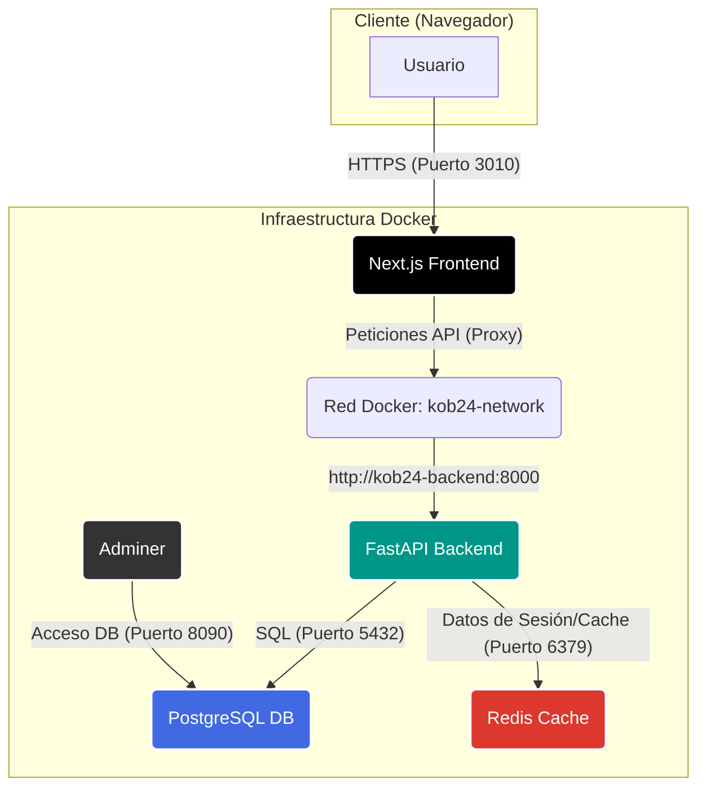

## Análisis de Arquitectura - UNS Kobetsu

### Resumen

El sistema UNS-Kobetsu presenta una arquitectura moderna y robusta, basada en microservicios containerizados y orquestados con Docker Compose. La separación clara entre el frontend (Next.js) y el backend (FastAPI), junto con el uso de una base de datos PostgreSQL y una caché Redis, conforma un stack tecnológico escalable y de alto rendimiento. La comunicación entre los servicios está bien definida y securizada dentro de una red Docker privada.

### Diagrama de Arquitectura

### Puntos Fuertes

1.  **Stack Tecnológico Moderno:** La elección de FastAPI y Next.js es excelente para crear aplicaciones web rápidas, modernas y escalables.
2.  **Containerización Completa:** El uso de Docker y Docker Compose simplifica enormemente el desarrollo, las pruebas y el despliegue, garantizando la consistencia entre entornos.
3.  **Arquitectura Orientada a Servicios:** La clara separación de responsabilidades entre el frontend, el backend, la base de datos y la caché facilita el mantenimiento y la escalabilidad independiente de cada componente.
4.  **Comunicación Segura y Eficiente:** El uso de un proxy en Next.js para las llamadas a la API a través de la red interna de Docker es una práctica de seguridad excelente. Evita la exposición innecesaria de puertos del backend y soluciona problemas de CORS de forma elegante.
5.  **Gestión de Autenticación Robusta:** La implementación de JWT con tokens de acceso y de refresco, junto con la renovación automática en el cliente, proporciona una experiencia de usuario fluida y segura.
6.  **Base de Datos y Migraciones:** La combinación de SQLAlchemy y Alembic es el estándar de oro en el ecosistema Python para la gestión de la base de datos y su esquema a lo largo del tiempo.
7.  **Estado del Frontend:** La combinación de React Query para el estado del servidor y Zustand para el estado global del cliente es una solución moderna, eficiente y que evita la complejidad de otras librerías de gestión de estado más verbosas.

### Recomendaciones y Puntos de Mejora

1.  **Seguridad de Tokens:**
    *   **Observación:** Los tokens de acceso y refresco se almacenan en `localStorage`, lo que los hace vulnerables a ataques XSS (Cross-Site Scripting).
    *   **Recomendación:** Para un entorno de producción con alta seguridad, considerar un enfoque híbrido:
        *   **Token de Acceso:** Mantenerlo en memoria (en una variable de la aplicación) para un acceso rápido y como primera línea de defensa.
        *   **Token de Refresco:** Almacenarlo en una cookie `HttpOnly` y `Secure`. Esto impide que sea accedido mediante JavaScript, ofreciendo una protección robusta contra XSS. El backend sería responsable de establecer y leer esta cookie durante el proceso de refresco del token.

2.  **Configuración y Gestión de Secrets:**
    *   **Observación:** La configuración se gestiona a través de variables de entorno en un archivo `.env`, lo cual es adecuado para desarrollo.
    *   **Recomendación:** Para producción, se recomienda utilizar un sistema de gestión de secretos más seguro, como **HashiCorp Vault**, **AWS Secrets Manager** o **Azure Key Vault**. Esto centraliza la gestión de credenciales y claves de API, mejora la seguridad y facilita la rotación de secretos.

3.  **Escalabilidad y Alta Disponibilidad:**
    *   **Observación:** La arquitectura actual está diseñada para ejecutarse en un único host a través de Docker Compose.
    *   **Recomendación:** Si los requisitos de escalabilidad o disponibilidad aumentan, el siguiente paso lógico es migrar la orquestación a **Kubernetes**. El `README.md` ya lo menciona, lo cual es positivo. Kubernetes permitiría escalar horizontalmente los servicios de frontend y backend de forma independiente y automatizar la recuperación ante fallos.

4.  **Observabilidad (Logging y Monitoreo):**
    *   **Observación:** El sistema ya expone métricas de Prometheus y tiene endpoints de `health check`, lo cual es un excelente punto de partida.
    *   **Recomendación:** Implementar una solución de **logging centralizado** como el stack **ELK (Elasticsearch, Logstash, Kibana)** o **Grafana Loki**. Esto permitiría agregar, buscar y analizar los logs de todos los contenedores en un solo lugar, lo cual es invaluable para la depuración en producción. Complementar Prometheus con **Grafana** para la visualización de métricas y **Alertmanager** para la configuración de alertas proactivas.

### Conclusión de la Fase 1

La arquitectura del sistema UNS-Kobetsu es sólida, bien diseñada y utiliza las mejores prácticas de la industria. Las recomendaciones presentadas no son críticas para el funcionamiento actual, sino que apuntan a fortalecer la seguridad y la escalabilidad del sistema de cara a un entorno de producción exigente.
